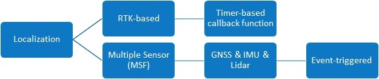
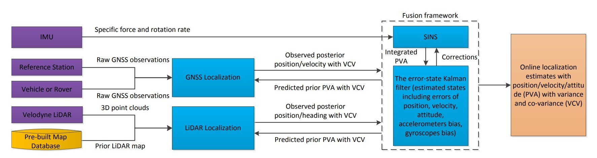
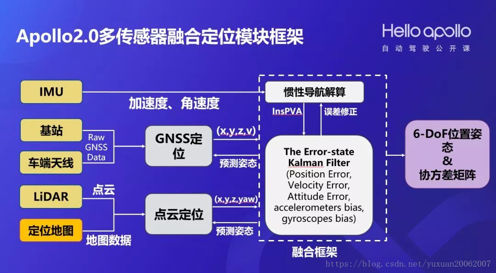

# Location

## 综述

了解了定位系统的重要性，我们来看看定位技术的分类。

从定位方式上可分为三类。

- 第一类，基于信号的定位，它的代表就是GNSS，其实就是全球导航卫星系统；

- 第二类，航迹推算，依靠IMU等，根据上一时刻的位置和方位推断现在的位置和方位；

- 第三类，环境特征匹配，基于Lidar的定位，用我们观测到的特征和数据库里的特征和存储的特征进行匹配，得到现在车的位置和姿态。

这三种定位方式各有优劣

 

第一种卫星定位，RTK差分技术出现后，精度稳步提高。差分技术，是在一个精确的已知位置（基站）上安装GNSS监测接收机，计算得到基站与GNSS卫星的距离校正。差分分为位置差分和距离差分。RTK差分可以达到厘米级定位。RTK存在的问题有：基站铺设成本较高；非常依赖卫星数量，比如在一些桥洞和高楼大厦的环境下，可视的卫星数量会急剧下降；容易受到电磁环境干扰。在受到遮挡时，信号丢失，没有办法做定位。

  

第二种捷联惯性导航（ SINS），是利用惯性测量元件（陀螺仪、加速度计）测量得到的载体相对于惯性空间角运动和线运动参数，经过惯性导航解算得到载体的速度、位置、姿态。捷联是相对于平台来说的。惯性测量单元（IMU）主要由陀螺仪和加速度计组成。加速度计能够测量出载体相对于惯性空间所受的力；陀螺仪能够测量出载体沿陀螺仪轴向的旋转角速度或旋转增量。IMU是惯性导航系统的基础，直接决定了惯性导航系统所能够达到的精度。

惯性导航（简称惯导）的基本工作原理是以牛顿力学定律为基础。惯导系统的价格很高。惯导系统通过陀螺仪获知航向和姿态角，通过加速度得到速度，进而形成导航坐标系；通过速度得到位移，可以得到六自由度的信息。优点是输出频率非常高，短时精度高，缺点就是误差随着时间累积。

  

第三种激光定位，要预先制作定位地图，不管是3D的还是2D地图。激光点云定位一般预先制作地图，然后用车上的实时点云和地图进行匹配，来计算激光雷达的位置和姿态，再通过激光雷达与IMU之间的外参，得到IMU的位置和姿态。匹配有很多种方法，可以是基于3D点云匹配的ICP方法，也可以是我们这里给出的基于2D概率地图的直方图滤波器匹配定位。激光定位的优点是在没有GPS情况下可以工作，鲁棒性比较好；缺点就是需要预先制作地图，同时要定期更新地图（因为环境会发生变化），雨雪天气也会受到影响（因为Lidar被折射的比较多，收到的点云数据变少）。

 

基于以上三种定位技术，百度提出多传感器融合的定位系统，既做到优势互补，也提高了稳定性，增强了定位精度。

 

**多传感器融合定位**

 

定位技术横跨好几个专业，包括测绘、导航、计算机视觉知识、以及点云处理的知识。

  

Apollo2.0的多传感器融合定位模块的框架如下图所示：

- 左边列出了定位模块依赖的硬件以及数据，包括惯性测量单元IMU、车端天线、基站、激光雷达、以及定位地图；
- 中间是GNSS定位以及激光点云定位模块，GNSS定位输出位置及速度信息，点云定位输出位置及航向角信息；
- 右边是融合框架，融合框架包括两部分：惯性导航解算、Kalman滤波；
- 融合定位的结果会反过来用于GNSS定位和点云定位的预测；
- 融合定位的输出是一个6-dof的位置和姿态，以及协方差矩阵。

 

**点云定位**  

先介绍点云定位子模块。

点云定位的输入是融合定位提供的预测位置和姿态、以及激光雷达的点云。点云定位主要包含有两个步骤：航向角优化、(x, y)计算，分别对应图像对齐、SSD-HF（直方图滤波器）两个部分。点云定位会输出x, y, z, yaw，z是通过定位地图来获取的。

关于点云定位，它有三个输入：融合定位提供的预测姿态、Lidar点云、定位地图。在点云子模块中包含两个功能：yaw优化和XY计算。Yaw优化用到了图像对齐，XY计算用了滤波器，最后会输出XY和yaw，也输出了一个Z。

 

先介绍XY怎么做，百度的方法是基于直方图滤波器，就是SSD。SSD是Sum of Squared Difference，是一种常用的度量方法，也叫差方和。

**把每个激光点的反射值或者高度值和定位地图对应值相减**，然后把差的平方加起来，每个度量值越小说明位置匹配的越好。

  

怎么匹配多个位置？我们用二维直方图滤波器，将其中心放在预测姿态(x0, y0)，滤波器一般选择21*21，那么搜索的范围就是2.6米* 2.6米，需要计算441个位置的SSD值。

我们可以看到有的地方匹配的比较好，比较好的就是红色值，比较差的是蓝色，绿色是过渡。

  

 

在直方图滤波器计算前，我们会对yaw做一次优化。

yaw的优化，即对航向角的优化。因为融合定位的时候很容易产生角度的误差，如果用低端的IMU更容易产生，尤其是最开始的时候误差非常大。在航向角有1.5度误差的时候，明显的看出来已经有较大偏差，为什么会有这么大的偏差？这个时候我们要做航向角的优化，如果不做，直接做SSD直方图分布，可以看到它会集中在一个区域，经过平均以后，位置大概在另一区域，和真值差了一米多，那就偏了。处理方法用的是图像处理Lucas-Kanade算法，主要是做图像的对齐。

 

对于反射值和高度值，做匹配的时候怎么联合起来？比如：左边有一个路段，反射值和匹配值经过平均以后，得到的位置会偏的很多，这时高度值定位非常好。用固定的方法加在一块，仍然得不到很好的分布，所以我们采用了自适应融合的方式，也就是说反射值和高度值分别计算直方图分布，由直方图分布的优劣来决定其权重。

 

我再举另一个例子，这是真实的路测例子，在扫描地图的时候路是这样的，后来他们重新铺设了，定位的时候只用反射值就会有误差。红色的是真值，蓝色是定位的结果。如下图左边所示，红色蓝色偏离的很厉害，这是非常危险的。调成固定权重的模式会好一点，如果采用自适应权重，则非常吻合。

 

**GNSS-RTK定位**

 

下面我们介绍GNSS-RTK定位。

现在惯导芯片一般都会配一个板卡（NovAtel也卖这样的板卡），直接集成了RTK的定位结果。为什么我们还需要自己开发GNSS-RTK呢？ 从系统的角度考虑，需要每个子模块都是可控的，举一个简单的例子，当给出一个定位结果偏了，但给出的方差很小，也就是置信度很高。我们是没办法知道原因的。

简单说一下它的原理，用GNSS天线获得车载原始的观测数据，通过3G、4G数据传输得到基站的原始观测，先做一个基于RAIM的车辆单点定位。单点定位的时候我们只知道大概的位置，再找基站和天线的共视星，然后做单差和双差。

 

单差是通过单差伪距和载波观测值作为EKF的时间更新，双差是构建双差模糊度与协方差，之后使用LAMBDA固定双差模糊度，然后使用固定模糊度后的载波完成量测更新。最后做融合定位。

 

上图中，RAIM是根据用户接收机的多余观测值监测用户定位结果的完好性，其目的是在导航过程中检测出发生故障的卫星，并保障导航定位精度。LAMBDA方法是指Least-squares AMBiguityDecorrelation Adjustment。

 

 

**惯性导航及融合定位**

接下来我们介绍惯性导航及融合定位。

  

我们引入几个坐标系，第一个是惯性坐标系（ECI），z轴是地球自转轴，x，y在赤道平面，x, y不随地球自转；第二个是地心地固坐标系(ECEF)，第三个是导航坐标系，第四个是载体坐标系。IMU的比力和角速度测量都是载体坐标系在惯性坐标系下的测量。一般情况下，都会建立一个导航坐标系，在导航坐标系下进行位置和姿态输出。（加速度计测量的不是载体的运动加速度，而是载体相对惯性空间的绝对加速度和重力加速度之和，称作“比力”。）

在这里我们简化一下，只考虑载体坐标系和惯性坐标系。

我们来解释一下导航解算的原理，它分下面几步：

\1. 姿态更新，对陀螺仪输出的角速度进行积分得到姿态增量，叠加到上次的姿态上；

\2. 比力坐标转换，是从IMU载体坐标系到位置、速度求解坐标系（惯性坐标系）；

\3. 速度更新，速度这一步需要考虑重力加速度的去除，得到惯性系下的加速度，通过积分得到速度；

\4. 位置更新，通过积分得到位置。

 

在惯性导航中，提到了导航方程的每一次迭代都需要利用上一次的导航结果作为初始值，因此在使用惯导之前必须进行初始化。初始位置和初始速度信息需要外部提供，一般是GNSS。

 

姿态对准是指得到IMU的roll,pitch, yaw；roll, pitch的对准过程一般称为调平：当车静止时，加速度计测量的比力仅由重力导致，可以通过f=C*g来求解；对于非常高精度的IMU可通过罗经对准的方式，车静止，通过测量载体系中的地球自转来确定载体的方位(yaw)。

 

对于车上使用的IMU，没那么高等级，一般采用两种方式：车直线跑起来，用从GNSS获取的速度方向来估计航向；第二种方式是采用双天线GNSS，通过两个位置连线来计算航向。

 

 

介绍完GNSS定位、点云定位以及惯性导航解算以后，我们看这几个模块怎么融合到一起。这里使用了Kalman滤波器的松耦合，意思就是我们只用了位置、姿态和速度做融合。

 

我们使用松耦合的方式把惯性导航解算、GNSS定位、点云定位三个子模块融合在一起。松耦合的数据只有位置、速度、姿态，紧耦合会包括GNSS的导航参数、定位中的伪距、距离变化等。

 

我们使用了一个误差卡尔曼滤波器，惯性导航解算的结果用于kalman滤波器的时间更新，也就是预测；而GNSS、点云定位结果用于kalman滤波器的量测更新。

 

Kalman滤波会输出位置、速度、姿态的误差用来修正惯导模块，IMU期间误差用来补偿IMU原始数据。 

 

这里单独把我们所做的Kalman滤波拿出来，如果做GNSS定位输出和点云定位的时候，我们会发现GNSS定位非常快，只要有原始消息就可以快速解算，但是点云定位的时间比较长，需要几十毫秒甚至上百毫秒，会出问题。也就是我们先收到的消息解算时间很长，才会有结果，会造成量测更新的乱序。我们解决这个问题的思路是用了两个滤波器，一个滤波器是Filter1，主要是做时间更新，实时的对外提供服务；量测更新是Filter2，我们会把Filter1的状态拷贝过来做量测更新，还会补齐最新时刻，用的是时间更新的方式，最后用Filter2代替Filter1，这样就解决了时间戳乱序的问题。

参考的论文如下：

**Robustand Precise Vehicle Localization based on Multi-sensor Fusion in Diverse CityScenes, ICRA, 2018.**

Localization

在这个模块里，Apollo提供了两种定位模式

1. RTK-based，即 GNSS+IMU的传统定位方式。 该模式属于 timer-triggered, 该模式下的定位应该会被周期性的调用。
2. 多传感器融合 (Multi-sensor Fusion Localization)，即 GNSS, IMU 和 Lidar 三者配合使用，完成定位。如下图所示，大体原理应该是这样的：首先比对 **Lidar 采集的点云**和**事先建好的地图**，得到 Lidar 的定位结果。之后 Lidar 定位 ，GNSS 定位，IMU 三者用卡尔曼滤波做融合。实现的具体原理参见这篇论文 [[1711.05805\] Robust and Precise Vehicle Localization based on Multi-sensor Fusion in Diverse City Scenes](http://link.zhihu.com/?target=https%3A//arxiv.org/abs/1711.05805)。

Robust and Precise Vehicle Localization based on Multi-sensor Fusionin Diverse City Scenes

