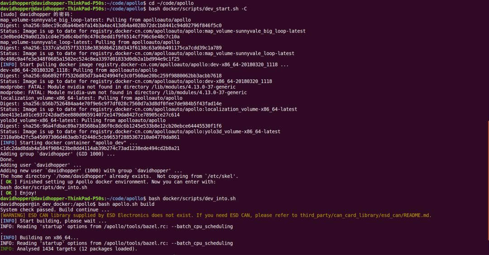

#### 1、Apollo 2.5版的构建

​	首先从GitHub网站【https://github.com/ApolloAuto/apollo】下载Apollo2.5版源代码，可以使用git命令下载，也可以直接通过网页下载压缩包。源代码下载完成并放置到合适的目录后，可以使用两种方法构建：1.在Visual Studio Code中构建（推荐）；2.使用命令行构建。当然，两种方法都有一个前提，就是在你的机器上已经顺利安装了Docker。Apollo之前版本提供了一个install_docker.sh脚本文件，因为很多开发者反映可能出错，Apollo项目组已将该文件移除。现在要安装Docker就只能参考Docker官方网站的帮助文档了。

##### 1.1在Visual Studio Code中构建

打开Visual Studio Code，执行菜单命令文件->打开文件夹，在弹出的对话框中，选择Apollo项目源文件夹，点击“确定”，如下图所示：


之后，执行菜单命令任务->运行生成任务或直接按快捷键Ctrl+Shift+B（与Visual Studio和QT的快捷键一致）构建工程，若之前没有启动过Docker，则编译时会启动Docker，需在底部终端窗口输入超级用户密码。命令执行完毕，若在底部提示 构建成功 的信息（如下图所示），则表示构建成功。整个过程一定要保持网络畅通，否则无法下载依赖包。构建过程可能会遇到一些问题，解决方法可直接查看GitHub网站的帮助文档.


##### 1.2在命令行中构建

```bash
# 按快捷键Ctrl + Alt + T打开命令行终端，输入如下命令启动Docker：
cd your_apollo_project_root_dir# 从中国大陆访问，最好加上“-C”选项，直接访问中国大陆镜像服务器以获取更快的下载速度
bash docker/scripts/dev_start.sh -C

# 输入如下命令进入Docker：
bash docker/scripts/dev_into.sh

#在Docker内部，执行如下命令构建Apollo项目：
bash apollo.sh build
```

整个操作如下图所示：

