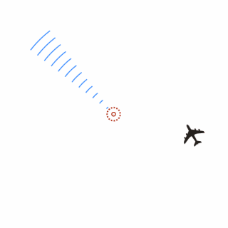

**激光雷达的分类**

从技术原理来看，激光雷达的类型主要有两种：

**旋转式激光雷达：**通过多束激光竖列而排，绕轴进行360°旋转，每一束激光扫描一个平面，纵向叠加后呈现出三维立体图形。多线束激光雷达可分为16线、32线、64线，线束越高，可扫描的平面越多，获取目标的信息也就越详细，线束低的激光雷达由于点云密度较低，容易带来分辨率不高的问题；

旋转式激光雷达运行原理图

**固态激光雷达：**摒弃了原有的机械扫描方式，采用相控阵原理，有许多个固定的细小光束组层，通过每个阵元点产生光束的相位与幅度，以此强化光束在指定方向上的强度，并压抑其他方向的强度，从而实现让光束的方向发生改变。

相控阵雷达运行原理图

由于固态式激光雷达，不具备旋转组件，这在一定程度降低了硬件成本和磨损消耗，且在个别光束阵元损坏的前提下，固态式激光雷达整体仍可持续工作，在可靠性上实现了大大提升。