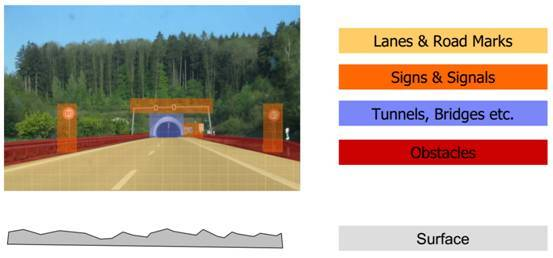
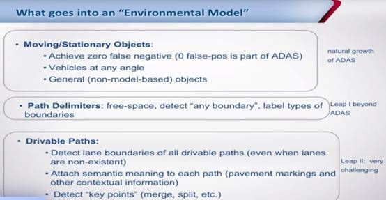

# 高精地图与定位技术现状

参考文章：<https://cloud.tencent.com/developer/article/1074521>

<https://cloud.tencent.com/developer/article/1063129>

<https://www.sohu.com/a/198522131_465591>

## 高精地图与定位

**首先高精度地图不同于普通地图，普通导航地图是给人看的，而高精度地图是面向机器，供自动驾驶汽车使用的地图数据。**

普通的导航系统基于普通的导航电子地图提供基础道路导航功能，包括由 A 地到 B 地的路径规划，车辆和道路的定位匹配，用于查询目的地的 POI 检索，在结合地图显示和道路引导的功能等。

而作为驾驶员的**人类具有提取信息、关联信息、过滤信息、视觉判断的能力，结合导航系统提供的这些相对粗略的信息就足够完成日常的导航和驾驶需要。**

可是作为自动驾驶车辆来说，无法完成诸如联想、解意、信息整合等工作，也许有一天人工智能足以匹敌人脑，但目前还远达不到人脑的高度，所以必须提供精细的地图信息。

**因此高精度地图就需要具备辅助完成实现高精度的  定位位置功能、道路级和车道级的规划能力、以及车道级的引导能力。**

假如在车上安装的传感器的所能感知的范围之外，也就是常说的超视距范围外，如果有一张辅助的高精度地图呢。

我们可以提前500米就知道前方有个路口，而且是个三岔路口，并且知道这个路口的形状，有两条车道，甚至有可能知道，这个路口经常有大型拖挂车通过，知道以上这些信息后，自动驾驶车辆的决策系统就在靠近路口的时候要求车辆需要提前减速，并且知道靠左行驶会更安全，所以也可以提前变换到左车道来，在结合道路的航向以及当时时间和天气，车辆也可以适当的调整摄像头的曝光参数以降低逆光的影响，等等，也许有了这些信息，这一类的事故就可以避免。

那么我们这里提到的高精度地图，又究竟是什么呢？

所谓的高精度地图，实际上是和我们现在已经普及的普通导航电子地图做比较来说的。

而所谓的高精度，实际上一方面是说高精度电子地图的绝对坐标精度更高，所谓绝对坐标精度指的是地图上的某个目标和真实的外部世界的事物之间的精度。另一方面，高精度地图所含有的道路交通信息元素更丰富和细致。

普通的导航电子地图的绝对坐标精度大约在10米左右，由于是辅助驾驶员做导航使用，外加上GPS设备的定位精度也在10米左右，所以这样的精度对整体来说影响不大。而应用在自动驾驶领域的高精度地图就不行了，自动驾驶汽车需要精确的知道自己在路的什么位子，往往车辆离马路牙子和旁边的车道也就几十厘米左右，所以高精度地图的绝对精度一般都会在亚米级，也就是1米以内的精度，而且横向的相对精度（比如，车道和车道，车道和车道线的相对位置精度）往往还要更高。并且高精度地图不仅有高精度的坐标，同时还有准确的道路形状，并且每个车道的坡度，曲率，航向，高程，侧倾的数据也都含有。

普通的导航电子地图会描绘出道路，而高精度地图不仅会描绘道路，更会描绘出一条道路上有多少条车道，会真实的反应出道路的实际样式，比如真实道路在某些地方变宽了，那么高精度地图中的道路数据也是变宽了，而某些地方因为汇合了而变窄了，高精度地图也是一样。另外，每条车道和车道之间的车道线是什么样子的，是虚线，是实现还是双黄线，线的颜色，道路的隔离带，隔离带的材质，马路牙子什么样子，什么材质，甚至道路上的箭头，文字的内容，所在位置都会有描述。另外为了自动驾驶的考虑，诸如每条车道的限速，推荐速度也需要一并提供。而像人行横道，道路沿线的看板，隔离带，限速标志，红绿灯，路边的电话停等等，这类我们通常统称为交通参与物的绝对地理坐标，物理尺寸以及他们的特质特性等也都会出现在高精度数据中。

除此以外，普通的导航电子地图和高精度地图的一大区别在于，普通的导航电子地图是面向驾驶员，供驾驶员使用的地图数据，而高精度地图是面向机器的供自动驾驶汽车使用的地图数据。

普通的导航系统基于普通的导航电子地图提供基础道路导航功能，包括由A地到B地的路径规划，车辆和道路的定位匹配，用于查询目的地的POI检索，在结合地图显示和道路引导的功能等，而作为驾驶员的人类是具有提取信息、关联信息、过滤信息、视觉判断的能力，结合导航系统提供的这些相对粗略的信息就足够完成日常的导航和驾驶的需要。可是作为自动驾驶车辆来说，无法完成诸如联想，解意，信息整合等工作，也许有一天人工智能足以匹敌人脑，但目前还远达不到人脑的高度，所以必须提供精细的地图信息。因此高精度地图就需要具备辅助完成实现高精度的定位位置功能，道路级和车道级的规划能力，以及车道级的引导能力。相反现在的高精度地图，因为所含盖的信息量太过丰富了，如果给驾驶员直接使用，反而会带来干扰。

在这里还要顺路提一下，介于普通的导航电子地图和高精度地图之间，还有一种应用在ADAS（主动安全场景）的地图。这种地图的的精度一般在1-5米左右，它是在普通的导航电子地图的基础上进行了扩充，比如在道路上补充了一些坡度，曲率，航向的一些辅助信息，另外也涵盖了车道数量，车道宽度的信息，并且道路的精度和形状信息更加的准确，只是这些信息的精度都和高精度地图有一个数量级的差别。这种地图在自动驾驶车辆的感知传感器足够丰富的时候也是能支持自动驾驶而使用的，而他的大部分应用场景主要是为了主动安全使用的。

这种地图在自动驾驶车辆的感知传感器足够丰富的时候也是能支持自动驾驶而使用的，它的大部分应用场景主要是为了主动安全使用的。

接下来，在 ADAS 和自动驾驶两个层面聊一聊如何来使用高精度地图。

这次我们先讲讲 ADAS（主动安全）中如何使用地图。

其实说到 ADAS，我们首先想到的诸如 ACC（自适应巡航），LDW（车道偏离预警），LKA（车道保持），FCW（前车碰撞预警）。而这些技术已经成熟，产品也已经量产，在近几年的高端车辆上装配，并且这些技术都和摄像头，毫米波雷达以及车身控制器有关，貌似和地图并没有多大关系。**实际上，如果结合了地图，这些功能会变得更强大。**

下面我们来举几个例子。

ACC（自适应巡航）实际上是由驾驶员设置一个最高的巡航速度，车上由前置的传感器，如摄像头或毫米波雷达来确认车辆正前方的可通行区域内是否有车辆，如果有车辆，则在安全制动距离内跟车，如果没有车辆，则加速到设置的循航速度。注意这里要特别强调「车辆正前方」，也就是车头的直线方向。如果是在直线行驶，或者道路曲率几乎可以视为直线的情况下，这种自适应巡航的功能是很棒的。

可是如果在弯道中，如下图，左侧车道中的车辆的传感器会错误的认为右方车道的车辆在自己前方，于是立即减速。可实际上车辆完全可以保持正常速度过弯。

亦或者，如下图中，左侧车道的车辆根本就察觉不到自己车道内前方转弯处有一辆车，也许车辆跟上去的时候，或者前车突然紧急刹车时，已经来不及减速，继而就容易发生事故了。

接着我们来讲讲地图在 ADAS 实现的技术方案以及 ADASIS 的工作原理。

乘着自动驾驶的这股热风，ADAS 概念越来越为人们所熟知，ADAS 产品也越来越普及，车厂与供应商们也都脑洞大开不断研发各种新的 ADAS 产品，提供越来越安全、轻松、环保的驾驶体验。

例如：ACC、FCW、LKA、前车灯跟随等等。

**ADAS 的实现离不开车辆上的各种如摄像头和雷达等感知传感器，但无论是多么豪华的传感器都是有其感知的局限性，或者称为感知范围。**

**如果能够让车辆获取到更远地方的数据，那么 ADAS 的功能必然可以得到增强。**

**如何得到远方的数据呢？**

在目前的技术条件下，获取远方数据的方式有很多，比如 V2X 技术，通过前方车辆或道路两旁的 V2X 设备向车辆发送路况信息；

又或者通过云技术也可以实现，从云端下发车辆收集的道路信息。但是这些方式都存在建设成本相对较高、建设周期长的问题。

还有就是地图。经过导航软件的普及，欧美、日本、中国的电子地图实际上基本比较成熟，而由于 ADAS 对地图的精度要求不是很高，只需要在普通的导航电子地图上追加一些 ADAS 属性，比如曲率、坡度、Heading Angle、更加精确的车道数量等属性即可提供道路先验知识，制作成本相对不高。

于是，**地图作为一种特殊的传感器（Map Sensor）融入 ADAS 系统。**

ADAS 系统包括感知系统、通信系统、决策系统和控制系统，地图信息如何在车辆的各个子系统中传输。**为了消除各图商、ADAS 零部件供应商之间协议的差异，并且更有利于 ADAS 地图的推广，图商、车厂、ADAS 零部件供应商联合起来成立了 ADASIS Forum 制定地图与 ADAS 系统之间的通信协议，也就是 ADASIS。**

ADASIS 全称 Advanced Driver Assistance Systems Interface Specifications，即是ADAS 的接口说明。**ADASIS 定义了地图在 ADAS 中的数据模型及传输方式，以 CAN 作为传输的通道。**现在 DASIS Forum 被划入 ERTICO（ITS Europe，欧洲的智能交通组织）。

目前 ADASIS 已经发布了 v1 和 v2 版本。

在 ADASIS v1 中，**系统会根据车辆当前位置以及最终目的地，提取所有的路径规划方案，将其中最为优先的路径称为最可能路径，而其他方案为备份方案。**所有的方案都会被提取并进行重构，并最终给出选择哪条路径以及如何驾驶通过的建议，传递到不同的 ADAS 系统中，但是导致系统中传递的数据量过大，所以并没有被车厂量产，越来越多的企业摈弃 v1 而推出了自己的通信方案。

由于 ADASIS v1 的不成熟严重影响了 ADASIS 的推行，最终经过 ADASIS Forum 的讨论，在排除企业内部因素之外，分析出企业不愿意使用 v1 的最主要原因在于标准过于复杂。复杂的通讯协议以及要求传输的数据过多，会让开发者在数据提取单元与重构单元上花费大量的时间与成本，这显然是不被车厂接受的。

因而，ADASIS v2 诞生了，着重改进在降低系统占用的 CAN 总线资源，以及使用最小原则提取并重构数据。目前 ADASIS v2 已经被多家车厂采用。

宏观上 ADASIS v2 结构中包含以下几个部分：

- **ADAS Horizion Provider**：地图信息提供者，负责数据组织与发送；
- **ADAS Protocol**：ADASIS 协议；
- **ADAS Application（ADAS Horizion Reconstructor）**：ADAS 应用，负责数据接收与解析及数据的使用；
- **CAN Bus**：作为信息传送的通道。

**ADASIS v2 System Architecture**

在 ADASIS v2 中，传输依照单路径（path）概念。也就是传递数据的时候只选择最有可能行驶的一条路径（实际上是地图上规划出来的路径），对于可能存在的备选路径，则以路径中的交叉路口（stub）来表示。每个交叉路口之间的路径称之为路段，路段被视为构成路径的基本单元，以每一个路段为单位，再进行数据的分析与利用。

**ADASIS v2 Data Model**

路段上属性则通过 Profile 和 Segment 来描述。Segment 描述路段大部分相同的属性，Profile 则描述剩余的属性，同时对属性数据进行压缩。另外传输数据时也不是每次发送所有数据，而是查询到数据变更或有新的数据才发送。这种数据组织与发送的方式去掉了大量冗余数据，减轻了通信负荷。

最后还有 Position 用来实时描述当前位置。

**ADAS Horizion Provider 遵循 ADASIS 协议将以上信息发送到 CAN 总线上。ADAS Application（ADAS Horizion Reconstructor）选择性的从 CAN 总线上获取自己有用的信息，重构地图，完成自己的应用。这样一来，ADAS 地图数据可以有效的传输到使用端，并且车辆改造最小，对 CAN 总线的影响也最小，最重要的是一切都是符合车规要求。**

而未来随着地图数据量的丰富，尤其进入到高精度地图时代，以及今后 ADAS 或自动驾驶的需要，都会对传输的数据量和传输频率提出更高要求，ADASIS v2 也越来越无法满足需求，**于是 ADASIS v3 以及基于车身以太网的传输方式也在研究中了**。人们对出行体验的需求越来越高，科技也随之飞速发展中，所以对于未来汽车自动驾驶的实现方式，就让我们拭目以待吧。

地图的重要性是毋庸置疑的，自从人类发明地图开始，从地理信息中挖掘出价值和知识的地理信息系统（Geographic Information System，GIS），已给科学和社会的进步带来了毋庸置疑的巨大贡献。从早期的纸质地图，到颠覆性创造之后的电子地图，从结构化和半结构化的单机地图，到地图数据库和地图数据仓库。伴随着计算机科学的飞速进步，地理信息系统也得到了充分的支持和长足的发展。目前，地理信息系统在人类的驾驶活动中以导航应用的形式存在，提供通向目的地的优选路径及导航信息。伴随汽车智能化的提升，导航应用为人们的生活带来了极大的方便。然而，传统导航应用由于商品化程度较深、地图格式各不相同和较粗的地图精度等原因，难以为自动驾驶系统所用。对智能驾驶和安全驾驶的迫切需求，业界推动了高精地图（High Precision Map，HPM）的研发。

坦率来讲我并不知道高精地图于定位的所有技术细节，但在使用过程中我非常能够体会到它的重要性，之前还写过几段相关的技术调研，一并贴上来。现有L3对该技术利用较少，致其误报率较高，进而用户体验较差，最终影响L3的普及使用和安全性。想像一下，如果L3对前方道路的曲率、上下坡道的坡度都能够有细致到车道级别（定位误差0.2米）的了解，使用前方道路的路网、曲率和坡度等信息，结合车辆运行状态，能够有效改进系统效果。从这种使用信息的方式来看，地图可谓是与相机、雷达、GPS等设备并列的智能传感器之一，而且比起其他传感器，地图有许多优点，如不受光照、雾霾和雷雨等天气影响，不受昼夜影响，更不受传感器安装位置及车型影响。

HPM 的开发通常需要地图提供商、车辆生产商和研究项目的共同合作。早期的工作由地图提供商TeleAtlas、NavTeq以及DARPA、SAFESPOT、INTERSAFE2、PreVENT等研究项目推动，主要的成果有现在常用的用于路网定义的路网定义文件Route Network Definition File，RNDF），被广泛用于地图定义以及智能车竞赛，以及路图（Road Graph）和局部动态地图（Local Dynamic Map，LDM）等。如上图所示，HPM提供车道级地图信息，包括车道类型（如高速、城区、乡村等公路级别、隧道、桥梁、施工路段等）、位置、朝向、曲率、坡度、限速等。

我了解的HPM格式有两种，分别是ADASIS和OpenDrive，介绍如下：

ADASIS，是ADAS Interface Specification的缩写，旨在为ADAS提供HMP信息。具体来讲，ADASIS通过称为ADAS地图信息片（Horizon）的形式提供车辆周围的HPM信息，为ADAS服务。为了便于ADAS调用，信息通过车载CAN总线给出。跟路口预警相关的信息是STUB信息，用于表示路口的道路信息，包括该路口位于整个路线中的位置、车道转角、车道数目、交规赋予的路权等。ADASIS的研发通过一个自组织社区的形式进行，成员包括ADAS提供商Continental Automotive、Bosch、dSPACE、IPG，地图和数据提供商Autonavi、Naavinfo、TomTom、HERE，车辆生产商BMW、Daimler、Ford、Honda、Toyota、Volkswagen等。

OpenDrive，是一个开放的路网逻辑标准，由VIRES公司于2005年发布第一版本，初衷是建立统一的路网逻辑，便于不同驾驶模拟器之间进行数据交换。后来由于智能及安全驾驶技术的需求，也被ADAS作为HPM的格式之一所用，可提供与ADASIS类似的信息。具体来讲，OpenDrive以XML格式提供车道级地图信息，并提供各编程语言的解析接口，方便开发者快速整合到自有环境。提供OpenDrive的研发也是通过自组织社区的形式，由VIRES公司主导。成员包括驾驶模拟器公司DLR、Fraunhofer、TMI Dynamatics、TrianGraphics，车辆生产商BMW、Daimler，智能交通研究机构VTI和TUM等。

在HPM的帮助下，自动驾驶系统的可用性和用户粘性增加了许多。如BMW公司利用HPM开发了驾驶速度推荐（Adaptive Speed Recommendation，ASR）模块。ASR在HPM提供道路曲率、路口、环岛和限速标志的情况下，实时为驾驶员推荐适合当前驾驶情况的车速。ASR减少了急刹急起的不良驾驶状态，有效改善了驾驶的舒适性。Craig提到几种ADAS利用HPM改进驾驶安全性的应用，包括根据道路的类型和几何特点动态调整灯光的自适应前灯，根据道路曲率、坡度计算驾驶员可视道路（Line-Of-Sight，LOS）来辅助偏僻道路超车，以及根据道路曲率、坡度辅助过弯的弯道速度预警。

**在更高级的智能驾驶应用中，目前HPM主要用于改进车辆定位的精度。**民用GPS定位的平面误差在10米左右，利用实时动态（Real Time Kinematic，RTK）GPS和连续运行卫星定位服务系统（Continuous Operational Reference System，CORS）改进的平面定位误差虽然可达厘米级，但由于RTK基站的覆盖范围有限，CORS基站搭建的成本较高等原因，难以在高速公路普及推广。Schindler利用HPM中的地标，构建原型拟合（prototype fitting）优化问题，改进蒙特卡洛定位模型的精度。Nedevschi利用HPM提供的道路拓扑、几何和地理信息，使用贝叶斯网络概率模型提高车道位置的识别精度，进而提高车辆的定位精度。在路口危险预警方面，目前HPM的应用较少，Lefevre在使用民用GPS的情况下，在贝叶斯网络模型中加入HPM提供的路网信息，该方法较好过滤了驾驶过程中的不确定性，改进了以往单独利用轨迹簇或车辆状态预测驾驶意图的效果。

**谈到技术水平，目前高精地图也是有很多家在做，都声称自己有很高的经度。所以存在一个怎么选择的问题，我的看法是看它配套的定位技术如何。**

## **技术现状** 

从应用角度来讲，Bosch给过一个高精地图的分层范例，上面两层涉及到V2X这里不多说，地下两层是通常意义来讲的高精地图静态数据，可以为自动驾驶行车决策提供强有力的指导。 

**TomTom展示车道级高精度定位技术**

之前的智驾周刊提到，近日地图公司TomTom发布视频展示其车道级高精度定位技术，建立在其高精度地图和车道级点云地图（RoadDNA）数据之上。在车辆实际运行过程中，定位算法会将实时点云数据与RoadDNA进行匹配，计算高精度位置。该技术可用于自动驾驶汽车的车道保持和路径规划中，在展示过程中，工程师还提到TomTom的地图冗余技术，以应对天气、交通标志和道路的日常变化。

**HERE**

被宝马戴姆勒等公司收购了的HERE在高精地图方面也很擅长，但我没有见到配套的定位技术文档，据说是在研。

**Mobileye**

应该是配装过程中饱受匝道口之苦，Mobileye也在年初提出了自己的高精度地图技术（称作REM，Road Experience Management），未使用复杂的3D激光雷达来采集和制作地图，CTO Shashua认为并不需要，而是通过图像中丰富的纹理和色彩特征来生成地图。Mobileye采取的策略是三维上稀疏，地面一维稠密的结构，三维元素不会包括原始图像数据，而是经过识别后的语义信息。

地面一维的信息则包括的比较多，建立了一个道路模型，包括车道线的精确位置、连接关系等。

值得一提的是，当前高精度地图供应商，在生产和维护地图方面成本很高，而Mobileye则采取群体智能的方式来解决这个问题，通过大量装配在量产车上的Mobileye现有产品来分布式收集和更新数据。

## **高精地图与定位解决匝道口隐患** 

其实解决这个问题很好办，只需要知道车辆在地图中的位置即可，下面介绍两个公开的方法，成本考虑都是基于视觉的。

智驾周刊之前提到，Audi公布的专利显示了该公司在匝道通行技术上的进展。该技术由一个内置车载摄像头和计算单元构成，通过获取图像并计算其中的关键地标（landmark）来判断匝道的位置，该技术可用于指导导航软件进行路径重规划以及指导自动驾驶系统完成上下匝道动作。

另一个就是利用Mobileye新版本中的环境模型（Environmental Model），包括运动和静止的物体、车道线、可行驶区域和交通标志等。

多年的积累让Mobileye在环境模型方面能够提供的内容远超竞争对手，在别人还在尝试提高单一车道线的检测精度时，Mobileye已经可以提供道路的语义级特征描述，例如当前行驶车道的左右车道线、左右车道的左右线以及道路分叉等等，均通过深度神经网络识别。

# ADAS阶段

## 1. 自适应巡航控制系统 Adaptive Cruise Control（ACC）

自适应巡航控制系统是一种智能化的自动控制系统，它是在早已存在的巡航控制技术的基础上发展而来的。在车辆行驶过程中，安装在车辆前部的车距传感器（雷达）持续扫描车辆前方道路，同时轮速传感器采集车速信号。当与前车之间的距离过小时，ACC控制单元可以通过与制动防抱死系统、发动机控制系统协调动作，使车轮适当制动，并使发动机的输出功率下降，以使车辆与前方车辆始终保持安全距离。

## 2．自动紧急制动 Autonomous EmergencyBraking（AEB）

AEB 是一种汽车主动安全技术，主要由3大模块构成，其中测距模块的核心包括微波雷达、激光雷达和视频系统等，它可以提供前方道路安全、准确、实时的图像和路况信息。AEB系统采用雷达测出与前车或者障碍物的距离，然后利用数据分析模块将测出的距离与警报距离、安全距离进行比较，小于警报距离时就进行警报提示，而小于安全距离时即使在驾驶员没有来得及踩制动踏板的情况下，AEB系统也会启动，使汽车自动制动，从而为安全出行保驾护航。

## 3. 智能大灯控制 AdaptiveFront Lights (AFL)

这是一种可以安装在车上的技术，可以根据道路的形状来改变大灯的方向。另一些智能大灯控制系统能够根据车速和道路环境来改变大灯的的强度。

## 4. 盲点检测（BlindSpot Monitoring (BSM)）

盲点检测系统，通过车辆周围排布的防撞雷达、多普勒雷达、红外雷达等传感器、盲点探测器等设施。由计算机进行控制，在超车、倒车、换道、大雾、雨天等易发生危险的情况下随时以声、光（侧视镜上的小灯闪烁）形式向驾驶员提供汽车周围必要的信息，并可自动采取措施，有效防止事故发生。

## 5. 注意力检测系统（DriverMonitoring Systems (DMS)）

系统运用感应器来检测驾驶员的注意力。如果司机看向马路前方，并且在此同时有危机的情况被检测到了。系统就会用闪光，刺耳的声音来警示。如果司机没有做出任何回应，那么车辆就会自动刹车。

## 6. 前方碰撞预警系统 Forward Collision Warning (FCW)

FCW 能够通过雷达系统和摄像头来时刻监测前方车辆，判断本车于前车之间的距离、方位及相对速度，当存在潜在碰撞危险时对驾驶者进行警告。FCW系统本身不会采取任何制动措施去避免碰撞或控制车辆。

## 7. 抬头显示器（Heads-Up Display (HUD)）

该技术把汽车行驶过程中仪表显示的重要信息（如车速）投射到前风挡玻璃上，不仅能够帮助对速度判断缺乏经验的新手控制自己的车速，避免在许多的限速路段中因超速而违章，更重要的是它能够使驾驶员在大视野不转移的条件下瞬间读数，始终头脑清醒地保持最佳观察状态。

## 8. 智能车速控制 Intelligent Speed Adaptation (ISA)

智能车速控制系统。该系统能识别交通标识，并根据读取的最高限速信息控制油门，确保驾驶者在法定限速内行驶，有效避免驾驶者在无意识情况下的超速行为。

## 9. 车道偏离告警 Lane Departure Warning (LDW)

车道偏离预警系统主要由 HUD抬头显示器、摄像头、控制器以及传感器组成，当车道偏离系统开启时，摄像头（一般安置在车身侧面或后视镜位置）会时刻采集行驶车道的标识线，通过图像处理获得汽车在当前车道中的位置参数，当检测到汽车偏离车道时，传感器会及时收集车辆数据和驾驶员的操作状态，之后由控制器发出警报信号，整个过程大约在0.5秒完成，为驾驶者提供更多的反应时间。而如果驾驶者打开转向灯，正常进行变线行驶，那么车道偏离预警系统不会做出任何提示。

## 10.汽车夜视系统 NightVision System（NVS）

汽车夜视系统，利用红外线技术能将黑暗变得如同白昼，使驾驶员在黑夜里看得更远更清楚。夜视系统的结构由2部分组成：一部分是红外线摄像机，另一部分是挡风玻璃上的光显示系统。

## 11. 泊车辅助 ParkingAssistance (PA)

泊车辅助系统通过安装在车身上的摄像头，超声波传感器，以及红外传感器，探测停车位置，绘制停车地图，并实时动态规划泊车路径，将汽车指引或者直接操控方向盘驶入停车位置。

## 12. 行人检测系统Pedestrian Detection System (PDS)

车辆行驶途中可以利用摄像头雷达，和激光雷达来探测到四面行人，在安全距离内及时控速。

## 13. 交通信号及标志牌识别 RoadSign Recognition (RSR)

 这个技术让车辆能够自动识别交通信号或者标志牌，比如说最高限速，或者停车等标示。

## 14.全景泊车停车辅助系统 SurroundView Cameras (SVC)

全景泊车停车辅助系统由安装在车身前后左右的四个超广角鱼眼摄像头，同时采集车辆四周的影像，经过图像处理单元畸变还原→视角转化→图像拼接→图像增强，最终形成一幅车辆四周无缝隙的360度全景俯视图。在显示全景图的同时，也可以显示任何一方的单视图，并配合标尺线准确地定位障碍物的位置和距离。

